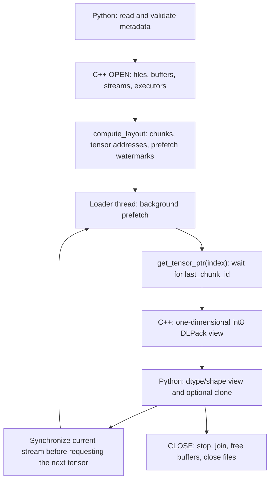

# InstantTensor Loader Internals

> **Language:** English (current) | [中文](./loader-internals.zh-CN.md)
>
> **Maintenance:** Keep this document and the Chinese version synchronized.

> **Version scope:** This document describes the loader in the **current
> repository source**. Update both language versions when `compute_layout()`,
> device-ring reuse, parameter semantics, or an I/O backend changes.

InstantTensor divides contiguous safetensors byte ranges into chunks, stages
them in host memory, moves them into a device ring buffer, and exposes them as
PyTorch tensors. This document focuses on the `io_uring` path.

Reproducible here means behavior-equivalent, not source-identical. Another
implementation may use different classes or async primitives, but it must:

- derive equivalent disk and device chunk boundaries from the same file offsets;
- preserve file, host, and device mappings, including rank partitioning;
- keep tensors contiguous on the device when they cross chunk boundaries;
- wait for the correct completion before reusing host windows, CUDA events, or device regions;
- enforce a watermark equivalent to `prefetch_chunk_id`;
- expose a tensor only after its final chunk has completed.

Key source locations:

- [`Loader::compute_layout`](../csrc/loader_common.cpp#L215)
- [`Loader::post_read_chunk`](../csrc/loader_common.cpp#L442)
- [`Loader::post_read_chunk_uring`](../csrc/loader_io_uring.cpp#L198)
- [`safe_open.tensors`](../instanttensor/_impl.py#L717)

## Lifecycle at a Glance



`compute_layout()` is entirely static: it determines where every chunk and
tensor will live and how far each tensor permits prefetch. The loader thread
then applies those watermarks while I/O, H2D, and optional NCCL work run in the
background. `CLOSE` is shown to complete the lifecycle; this document covers
its safety requirements, not every production cleanup branch.

## Scope and Completeness

This document is sufficient to reproduce the behavior-equivalent core of the
current io_uring loader:

- metadata normalization needed by layout;
- disk, host, and device chunk mapping;
- `compute_layout()`, including ring wrap and overwrite watermarks;
- io_uring submission/completion, H2D, and optional NCCL all-gather;
- prefetch advancement, tensor completion, and DLPack/PyTorch views.

It is not a production-complete specification of the entire package. In
particular, it does not exhaustively reproduce:

- backend probing, selection, fallback, and filesystem policy;
- frontend buffer recommendation and free-memory heuristics;
- host-buffer cache or pooling policy;
- every close, cancellation, partial-initialization, and error-cleanup path;
- backend-specific behavior for AIO, cuFile, mmap, and other non-io_uring paths.

Those areas may be implemented differently without changing the core behavior
described here. A production replacement still needs to define them.

## External Assumptions and Caller Contract

| Category | Requirement | Current enforcement |
| --- | --- | --- |
| File shape | The file list is nonempty; each safetensors file contains at least one tensor; normal supported inputs have nonempty payloads | Partly implicit; all-zero-sized inputs are not a supported compatibility target |
| Offsets | Tensor ranges are ordered by file offset and adjacent ranges are contiguous | Python sorts and validates continuity |
| Dtype/alignment | Dtypes must be supported; file order does not need to preserve target-dtype alignment | Python clones an unaligned `int8` view before dtype reinterpretation |
| Access order | Tensor indices advance in offset order; iteration is single-pass | Python iteration and C++ `current_tensor_index` rely on monotonic access |
| Distributed input | Every rank uses the same sorted files, metadata, layout parameters, and compatible process group | Caller responsibility |
| `copy=False` | An aligned tensor is a ring view and must not outlive overwrite or close; an unaligned tensor becomes an independent fallback copy; work on another CUDA stream requires caller-managed synchronization | Frontend warning plus caller responsibility |

## 1. Overall Model

There is no single `Chunk` object that owns disk, host, and device storage.
`Chunk` mainly describes a file range and its device destination:

```cpp
struct Chunk {
    size_t size;
    size_t file_index;
    size_t file_offset;
    size_t device_buffer_offset;
    ...
};
```

One logical chunk has three runtime representations:

| Layer | Contents | Lifetime |
| --- | --- | --- |
| disk | `[file_offset, file_offset + size)`; may include a page-alignment prefix and reread a page shared with an adjacent chunk | Static layout |
| host | The slice assigned to this rank in pinned window `chunk_id % io_depth` | Until the window is reused |
| device | The complete world chunk; ranks first write their slices, then NCCL all-gather fills every slice | Until prefetch may overwrite that ring region |

They are not equal-sized copies. Disk and device describe a world-wide chunk,
while each process stages only one rank slice. After distributed completion,
every rank has the complete world chunk on its device.

### 1.1 Rank and `torch.distributed`

In distributed mode, a rank is a process index in a
`torch.distributed` process group, not an I/O thread. A typical deployment
runs one process per GPU: `world_size` is the number of participating
processes, and `rank` is in `[0, world_size)`. The caller initializes the
process group and passes it to InstantTensor; InstantTensor does not launch
these processes. Without a process group, it uses `world_size=1`, `rank=0`,
and skips NCCL all-gather.

Every process opens the same model files and owns a separate host staging
buffer and device buffer on its GPU. For each chunk, ranks read disjoint file
slices into their local buffers. The NCCL communicator obtained from the
process group then all-gathers those slices so every process receives the full
world chunk.

## 2. Base Sizes and Alignment

These symbols correspond to `Loader::init_buffer()`:

```text
A = rank_alignment = system page size, normally 4096
R = rank_chunk_size = round_up(user chunk_size, A)
P = world_size = number of processes in the torch.distributed process group
rank = process index in [0, P)
W = world_chunk_size = R * P
Aw = world_chunk_alignment = A * P
D = io_depth
C = concurrency, the MMAP/cuFile worker count
F = first_tensor_alignment = 16
```

Python `chunk_size` becomes the maximum size `R` of one rank-local I/O request.
The normal upper bound of `Chunk::size` is `W = R * P`; a C++ chunk is
partitioned only by rank.

```text
device buffer >= D * W + layout padding
host buffer    = D * R                     # one rank of data per process
```

The device allocation includes conservative padding for file-page prefixes,
first-tensor alignment, and world-chunk tail alignment.

### 2.1 Terminology Traps

| Name | Meaning in the implementation | Common misreading |
| --- | --- | --- |
| `chunk_size` | After page rounding, the maximum rank-local request size `R` | The size of one world-wide C++ `Chunk` |
| `concurrency` | Worker count for synchronous MMAP memcpy and cuFile reads; ignored by native-async backends and layout | A cross-backend I/O-depth multiplier |
| `io_depth` | Maximum rank-local requests/pipeline entries in flight, and the number of reusable host windows/events | Only the kernel storage queue depth |
| `buffer_size` | A frontend capacity request that C++ first raises to at least `D * W`, then pads before layout | The exact number of bytes originally requested by the user |

Backend defaults preserve the previous request capacity after removing the
thread-segment layer. In-memory MMAP uses `D = 3 * C`; cuFile uses
`D = 16 * C`. Native-async backends resolve `D` independently of `C`, and an
explicit `concurrency` value cannot change their layout or memory use. Free
device-memory pressure shrinks only `io_depth`. The accepted range is
`1 <= io_depth <= 1024`, matching the executor capacity.

The names come from several layers of the implementation. Use `R`, `W`, and
`D` when reasoning about layout to avoid treating similarly named
objects as identical.

### 2.2 Effective Buffer Size and Initialization Order

Before layout, C++ computes:

```text
effective_device_buffer_size =
    max(frontend_buffer_size, io_depth * world_chunk_size)

allocated_device_buffer_size =
    effective_device_buffer_size
    + 3 * (first_tensor_alignment + rank_alignment
           + world_chunk_alignment)
```

The implementation updates `buffer_size` to this padded allocation size.
`compute_layout()` uses that value for capacity checks. A reimplementation may
keep requested and allocated sizes separate, but must use the allocated size to
reproduce the current wrap boundaries.

```text
Python:
    read and validate metadata
    choose chunk_size / concurrency / io_depth
    choose frontend buffer_size
    call C++ open

C++:
    open files and initialize io_uring
    derive A, R, W, Aw
    enlarge and allocate the device buffer
    allocate/register the host buffer and register it with io_uring
    create CUDA/NCCL streams, per-window events, and executors
    compute_layout(tensor_offsets)
    enter the loader RPC/prefetch loop
```

Backend initialization determines whether host staging is needed. Host memory
must be allocated before fixed-buffer registration.

## 3. Input to `compute_layout`

The Python frontend:

1. sorts files by name;
2. reads each safetensors header;
3. sorts tensors in each file by `data_offsets[0]`;
4. requires adjacent tensor ranges to be contiguous;
5. adds the header size to each data-relative offset;
6. appends one tensor-data end offset per file.

```text
(file0, tensor0_begin)
(file0, tensor1_begin)
...
(file0, file0_tensor_data_end)
(file1, tensor0_begin)
...
```

The final offset lets adjacent entries determine tensor size. A pair crossing a
file boundary only finishes the previous chunk and switches files.

The current implementation also assumes:

- file indices start at zero and are contiguous; offsets are ordered by file and address;
- every safetensors file has at least one tensor;
- normal model inputs have nonempty payloads. Zero-sized tensors are not explicitly rejected, but an all-zero-sized file can fail to form a chunk under some alignments and leave no valid `last_chunk_id` completion.

A replacement may reject metadata outside this domain. Supporting empty tensors
requires explicit empty-view and completion semantics.

## 4. How `compute_layout` Creates Chunks

### 4.1 File-Side Layout

A chunk never crosses a file. The first chunk starts at or before the first
tensor on a page boundary:

```text
chunk_file_offset = round_down(first_tensor_file_offset, A)
left_prefix        = first_tensor_file_offset % A
```

The prefix can contain a safetensors-header tail. It exists for direct-I/O
alignment and is never exposed as tensor payload.

`current_chunk_size` grows over consecutive tensors. Normal chunks have size
`W`, except at file ends and near device-ring wraps. After a non-page-aligned
chunk finishes:

```text
next_file_offset += round_down(current_chunk_size, A)
remaining_prefix  = current_chunk_size % A
```

The remainder becomes the next left prefix, so adjacent disk chunks may reread
up to `A - 1` bytes from the same page.

### 4.2 Device-Side Layout

```text
device_address(file_byte) =
    device_buffer
  + chunk.device_buffer_offset
  + (file_byte_offset - chunk.file_offset)
```

Within one linear region, each finished chunk advances by:

```text
next_chunk_device_offset += round_up(chunk.size, Aw)
```

`Aw = A * P` lets a padded chunk divide into `P` page-aligned rank slices.

If the next complete tensor does not fit, layout finishes the current chunk at
the tensor boundary and wraps to a low device address. This is not
`offset % buffer_size`: the new start is adjusted so the first tensor is
16-byte aligned.

The 16-byte value is not an I/O-alignment requirement. PyTorch requires a
tensor address to be aligned to its element size, and 16 bytes is the largest
possible element size, for `torch.complex128`. Thus aligning the first tensor
to `F = 16` satisfies the strongest element-alignment requirement.

Only the first tensor of each file, and the first tensor after a device-ring
wrap, receives explicit device padding. For a file laid out in non-increasing
element-size order, this is sufficient to keep every tensor aligned. Let
`a_i` be the device address and `e_i` the element size of tensor `i` in one
contiguous region. Supported element sizes are powers of two up to 16, so:

```text
a_0 % 16 == 0
tensor_size_i % e_i == 0
e_(i+1) divides e_i
a_(i+1) = a_i + tensor_size_i
```

By induction, `a_i % e_i == 0` for every tensor in that common layout.
Explicit alignment is needed again at a file boundary because file-page
padding breaks payload continuity, and after a ring wrap because placement
restarts in a different device region.

Safetensors does not require non-increasing element sizes. For another order,
a later tensor can be unaligned for its dtype. C++ can still expose its bytes
as an `int8` DLPack view, whose alignment requirement is one byte. Python
checks the target dtype alignment and, only when needed, clones that byte view
into independently allocated storage before dtype reinterpretation. Therefore
arbitrary element-size orders are supported while aligned `copy=False`
tensors remain zero-copy.

### 4.3 Tensor Addresses and Cross-Chunk Continuity

Each tensor records:

```text
size
file_index / file_offset
device_buffer_offset
last_chunk_id
prefetch_chunk_id
```

Its first device byte is:

```text
tensor.device_buffer_offset =
    tensor.file_offset
  - chunk.file_offset
  + chunk.device_buffer_offset
```

Large tensors split only on full `W` boundaries. A full chunk also reserves
exactly `W` device bytes, so fragments remain adjacent. Padding appears only
at tensor boundaries, file boundaries, or ring wraps. Runtime therefore needs
no chunk concatenation or per-tensor assembly copy.

### 4.4 `prefetch_chunk_id`

Layout tracks the earliest tensor still resident, the tensor at the lowest
device address, and device offset advancement/wrap. Before later chunks can
reuse an older tensor region, layout assigns that tensor a
`prefetch_chunk_id`.

The value is the last chunk that may be submitted while the tensor can still be
in use without overwriting its device bytes. Runtime prefetch continues only
while:

```text
chunk_reading < current_tensor.prefetch_chunk_id
```

#### Worked Ring-Wrap Example

Use one rank and one I/O request per chunk:

```text
A = R = W = Aw = 4096
P = D = 1
F = 16
frontend_buffer_size <= 4096
device_buffer_size =
    max(frontend_buffer_size, D * W) + 3 * (F + A + Aw)
  = 4096 + 3 * (16 + 4096 + 4096)
  = 28720
```

One file starts its payload at file offset 4096 and contains nine contiguous
4096-byte tensors `T0..T8`. Every tensor occupies one chunk. Initial file
setup places `T0` at device offset 16. Chunks then advance by 4096 bytes:

| Tensor | `last_chunk_id` | Device offset | Final `prefetch_chunk_id` |
| --- | ---: | ---: | ---: |
| T0 | 0 | 16 | 6 |
| T1 | 1 | 4112 | 7 |
| T2 | 2 | 8208 | 8 |
| T3 | 3 | 12304 | 8 |
| T4 | 4 | 16400 | 8 |
| T5 | 5 | 20496 | 8 |
| T6 | 6 | 24592 | 8 |
| T7 | 7 | 16 | 8 |
| T8 | 8 | 4112 | 8 |

Before `T7`, placing another tensor linearly would require:

```text
24592 + round_up(4096 + 4096, 4096) = 32784 > 28720
```

Therefore chunk 6 is finished and `reset_device_region(7)` wraps the next
region to device offset 16. The relevant state transitions are:

| Event | `chunk_device_offset` after event | `in_buffer_tensor_id` | `left_most_tensor_id` | Local chunk ID | Watermarks assigned |
| --- | ---: | ---: | ---: | --- | --- |
| After initial `reset_file` | 16 | 0 | 0 | - | none |
| After placing T6 | 24592 | 0 | 0 | chunks 0-5 finished; chunk 6 open | none |
| Finish chunk 6, then wrap before T7 | 16 | 0 | 7 | `previous_chunk_id=5`, `latest_chunk_id=6` | none yet |
| Finish chunk 7 while placing T8 | 4112 | 1 | 7 | `previous_chunk_id=6` | `T0.prefetch_chunk_id=6` |
| Final `finish_chunk` for chunk 8 | 8208 | 2 | 7 | `previous_chunk_id=7` | `T1.prefetch_chunk_id=7` |
| First final reset | 16 | 7 | 9 | `latest_chunk_id=8` | T2 through T6 get 8 |
| Second final reset | 16 | 9 | 9 | `latest_chunk_id=8` | T7 and T8 get 8 |

`T7` reuses exactly the device interval occupied by `T0`, so a caller using
`T0` may submit only through chunk 6. Advancing to `T1` permits chunk 7;
advancing to `T2` permits chunk 8. Assignment happens during later static
layout transitions, but all watermarks are complete before runtime prefetch
starts.

### 4.5 Behavior-Equivalent Layout Pseudocode

```text
input:
    offsets = [(file_index, absolute_file_offset), ...]
    # Each file contributes tensor begin offsets and one data-end offset.

state:
    chunks = []
    tensors = array(num_tensors)
    chunk_file_index
    chunk_file_offset
    chunk_device_offset = 0
    current_chunk_size = 0
    tensor_id = 0
    in_buffer_tensor_id = 0
    left_most_tensor_id = 0

tensor_device_offset(file_offset):
    return file_offset - chunk_file_offset + chunk_device_offset

finish_chunk():
    if current_chunk_size == 0:
        return
    chunks.push({
        size: current_chunk_size,
        file_index: chunk_file_index,
        file_offset: chunk_file_offset,
        device_buffer_offset: chunk_device_offset,
    })
    assert chunk_file_offset % A == 0

    # Advance only by full file pages; the next chunk rereads the page tail.
    chunk_file_offset += round_down(current_chunk_size, A)

    # Reserve an Aw-aligned device range for rank partitioning.
    chunk_device_offset += round_up(current_chunk_size, Aw)
    current_chunk_size %= A

    previous_chunk_id = len(chunks) - 2
    while in_buffer_tensor_id < left_most_tensor_id and
          tensors[in_buffer_tensor_id].device_buffer_offset < chunk_device_offset:
        tensors[in_buffer_tensor_id].prefetch_chunk_id = previous_chunk_id
        in_buffer_tensor_id += 1

reset_device_region(new_left_most_tensor_id):
    assert current_chunk_size < A
    latest_chunk_id = len(chunks) - 1
    while in_buffer_tensor_id < left_most_tensor_id:
        tensors[in_buffer_tensor_id].prefetch_chunk_id = latest_chunk_id
        in_buffer_tensor_id += 1

    # Match the source: zero remainder still leaves 16 bytes, not zero.
    chunk_device_offset = 16 - (current_chunk_size % 16)
    left_most_tensor_id = new_left_most_tensor_id

reset_file(file_index, first_tensor_offset):
    assert current_chunk_size < A
    chunk_file_index = file_index
    chunk_file_offset = round_down(first_tensor_offset, A)
    current_chunk_size = first_tensor_offset % A
    chunk_device_offset =
        round_up(chunk_device_offset, 16)
        + 16
        - (current_chunk_size % 16)

reset_file(offsets[0].file_index, offsets[0].file_offset)

for each adjacent pair (offsets[i], offsets[i + 1]):
    file_index, tensor_file_offset = offsets[i]
    next_file_index, next_offset = offsets[i + 1]

    if file_index != next_file_index:
        finish_chunk()
        reset_file(next_file_index, next_offset)
        continue

    assert current_chunk_size == tensor_file_offset - chunk_file_offset
    tensor_size = next_offset - tensor_file_offset
    assert tensor_size <= device_buffer_size

    # Wrap only between tensors, never split a tensor across ring ends.
    required_end =
        chunk_device_offset
        + round_up(current_chunk_size + tensor_size, Aw)
    if required_end > device_buffer_size:
        finish_chunk()
        reset_device_region(tensor_id)

    first_device_offset = tensor_device_offset(tensor_file_offset)
    bytes_left = tensor_size

    # Split large tensors only at full W boundaries.
    while current_chunk_size + bytes_left > W:
        bytes_to_boundary = W - current_chunk_size
        current_chunk_size += bytes_to_boundary
        bytes_left -= bytes_to_boundary
        finish_chunk()

    current_chunk_size += bytes_left
    tensors[tensor_id] = {
        size: tensor_size,
        file_index: file_index,
        file_offset: tensor_file_offset,
        device_buffer_offset: first_device_offset,
        last_chunk_id: len(chunks),   # ID of the unfinished current chunk
    }
    tensor_id += 1

finish_chunk()

# Finalize the previous linear region, then the final region.
reset_device_region(tensor_id)
reset_device_region(tensor_id)
```

Commonly missed details:

1. disk offsets advance only by complete pages, so page tails may be reread;
2. ring wrap occurs only between tensors;
3. `prefetch_chunk_id` comes from static device overlap, not a fixed ID offset.

## 5. Mapping One Chunk Across Three Layers

```text
S  = c.size
Sw = round_up(S, Aw)
Sr = Sw / P                         # padded_rank_size
r0 = Sr * rank                      # rank_offset
rs = clamp(S - r0, 0, Sr)           # rank_size, valid bytes
```

### 5.1 Disk

The rank owns:

```text
[c.file_offset + r0, c.file_offset + r0 + rs)
```

```text
read_size = round_up(rs, A)
```

File offset, host address, and read size are page aligned for `O_DIRECT`.
The final read may extend past the logical chunk end, but H2D copies only
`rank_size` valid bytes.

### 5.2 Host

```text
window_index  = chunk_id % D
window_offset = window_index * R
rank_mid      = host_buffer + window_offset
```

The pinned host buffer is a ring of `D` windows. Each window holds one rank
slice. Before chunk `k` reuses a window, the loader waits for `k - D`.

### 5.3 Device

```text
rank_dst = device_buffer + c.device_buffer_offset + r0
all_dst  = device_buffer + c.device_buffer_offset
```

With one rank, H2D completion completes the chunk. With multiple ranks:

```text
rank 0: disk slice 0 -> device slice 0 --+
rank 1: disk slice 1 -> device slice 1 --+--> all-gather --> full chunk on every GPU
...
```

This is byte partitioning, not semantic tensor sharding. A tensor may cross rank
slices; all-gather restores the complete tensor on every GPU.

```text
Sw = round_up(c.size, Aw)
Sr = Sw / P
```

- For `P == 1`, H2D writes only `c.size`; reservation padding is untouched.
- For `P > 1`, NCCL writes all of `[all_dst, all_dst + Sw)`. Bytes after `c.size` are undefined padding and cannot be tensor data.
- A valid rank slice may be smaller than `Sr`, but all-gather still transfers `Sr`. Layout and overwrite checks must include the full padded `Sw`.

## 6. io_uring Loading Pipeline

### 6.1 Initialization

`URING` uses `O_DIRECT`. `URING_BUFFERED` uses a normal descriptor plus
`POSIX_FADV_SEQUENTIAL`. Both:

- allocate and CUDA-register pinned host memory;
- create an io_uring sized `io_depth`;
- register files as fixed files;
- register host memory in iovecs of at most 1 GiB.

A read contained in one registered segment uses
`io_uring_prep_read_fixed`; a crossing read uses `io_uring_prep_read`.

### 6.2 SQE Submission

`post_read_chunk_uring()` creates one SQE for the rank slice when it is nonempty:

```text
file rank slice -> host window
```

Both direct and buffered io_uring paths submit
`round_up(logical_size, PAGE_SIZE)`; buffered I/O intentionally reuses the
direct-I/O range, while H2D copies only logical bytes. `URING_BUFFERED` also
sets `IOSQE_ASYNC` to avoid a large inline page-cache copy on the loader
thread. A non-page-aligned final rank slice sets it as well.

All backends use `chunk_id` as the request coordinate and the same rank-size
calculation. io_uring stores it in SQE `user_data`, while libaio stores it in
`iocb->data`. cuFile and MMAP use executor request IDs instead. Each chunk's
`unfinished_cnt` is therefore either zero or one.

### 6.3 CQE, H2D, and NCCL

```text
loader thread:
    io_uring_get_sqe -> prepare -> io_uring_submit

cuda_thread (single-thread executor):
    io_uring_wait_cqe / cqe_seen
    -> cudaMemcpyAsync(host rank slice -> device rank slice)
    -> record CUDA event
    -> optional NCCL all-gather on nccl_stream
    -> record completion event

wait_thread (single-thread executor):
    reap cuda_thread task
    -> cudaEventSynchronize
    -> publish chunk completion
```

Disk I/O for multiple chunks can be in flight. CQEs may arrive out of order.
The completion metadata recovers `chunk_id`, selecting the correct
`unfinished_cnt` and logical rank size. A nonnegative short read
is accepted only when it still covers the complete logical rank slice; page-rounded
padding may be absent. `poll_read_chunk()` and `wait_read_chunk()` reap final
completion handles in
chunk order, making `chunk_read` a contiguous completed prefix.

### 6.4 Behavior-Equivalent Runtime State Machine

```text
current_tensor_index = 0
chunk_reading = -1   # greatest submitted chunk ID
chunk_read = -1      # greatest ID in the contiguous completed prefix

can_step():
    if layout is not initialized:
        return false
    tensor = tensors[current_tensor_index]
    limit = tensor.prefetch_chunk_id
    assert chunk_reading <= limit
    return chunk_reading < limit

post_read_chunk():
    chunk_id = chunk_reading + 1
    chunk_reading = chunk_id
    c = chunks[chunk_id]

    reuse_guard =
        max(chunk_id - MAX_IO_DEPTH,
            chunk_id - io_depth)
    if reuse_guard >= 0:
        wait_read_chunk(reuse_guard)

    p = make_runtime_mapping(c, chunk_id)
    completion = submit_uring_h2d_allgather(p)
    chunks[chunk_id].completion = completion

poll_read_chunk():
    next = chunk_read + 1
    while next <= chunk_reading:
        if not try_reap(chunks[next].completion):
            break
        next += 1
    chunk_read = next - 1

wait_read_chunk(target):
    assert target <= chunk_reading
    next = chunk_read + 1
    while next <= target:
        reap(chunks[next].completion)
        next += 1
    chunk_read = next - 1

step():
    post_read_chunk()
    poll_read_chunk()

wait_step(target_chunk):
    while chunk_read < target_chunk:
        if can_step():
            step()
        else:
            wait_read_chunk(target_chunk)

get_tensor_ptr(tensor_index):
    assert tensor_index >= current_tensor_index
    current_tensor_index = tensor_index
    wait_step(tensors[tensor_index].last_chunk_id)
    return device_buffer + tensors[tensor_index].device_buffer_offset
```

`submit_uring_h2d_allgather()` performs:

```text
1. Prepare one SQE when the current rank slice is nonempty.
2. Store `chunk_id` in completion metadata and read the rank slice into its host window.
3. Submit the SQE and set `chunks[chunk_id].unfinished_cnt` to zero or one.
4. On the single-thread CUDA executor:
   a. decode each CQE chunk ID, reject bytes_read < logical_size, and
      decrement the matching chunk unfinished_cnt;
   b. wait until unfinished_cnt of the current chunk reaches zero;
   c. cudaMemcpyAsync host rank slice -> device rank slice;
   d. record the window event on cuda_stream;
   e. if world_size > 1, make nccl_stream wait, run in-place all-gather,
      and record the same event again on nccl_stream.
5. On the completion executor:
   a. wait for the CUDA task to finish launching work;
   b. cudaEventSynchronize(event);
   c. publish the task as the chunk completion handle.
```

Different async machinery is valid, but completion must mean disk read, H2D, and
optional all-gather have all finished. Only then may `chunk_read` advance or a
host window/event be reused.

### 6.5 Loader Main Loop and Prefetch Advancement

```text
while not stopping:
    if not can_step() or rpc_queue is not empty:
        request = rpc_queue.pop()      # block when needed
        result = dispatch(request)
        response_queue.push(result)

    if can_step():
        step()
    else:
        poll_read_chunk()
```

Consequences:

- prefetch starts after `OPEN`, before the first tensor request;
- it stops at the watermark of `current_tensor_index`;
- requesting the next tensor opens a new safe prefetch interval;
- RPC cannot be indefinitely starved by prefetch;
- `chunk_read` advances only over a contiguous completion prefix.

## 7. Constructing a PyTorch Tensor

`get_tensor_ptr(index)` requests tensors approximately in file order, waits
for `tensor.last_chunk_id`, then returns:

```text
device_buffer + tensor.device_buffer_offset
```

C++ wraps the address and byte size as a one-dimensional `int8` DLPack tensor:

```python
tensor_int8 = torch.from_dlpack(dl_tensor)
required_alignment = torch.empty((), dtype=torch_dtype).element_size()
if copy or tensor_int8.data_ptr() % required_alignment != 0:
    tensor_int8 = tensor_int8.clone()
tensor = tensor_int8.view(torch_dtype).view(shape)
```

DLPack creates a view over already contiguous bytes. No concatenation occurs.
`copy=True` always clones into independent storage. With `copy=False`, an
aligned tensor remains a ring-buffer view that later prefetch may overwrite;
an unaligned tensor emits a `RuntimeWarning` and falls back to an independent
clone. PyTorch's CUDA allocator is expected to make the cloned storage
512-byte aligned, which is sufficient for every supported element size, but
this is an implementation detail rather than a correctness contract. The
final target-dtype alignment check remains authoritative.

## 8. Prefetch and Compute Overlap

After `OPEN`, the independent loader thread calls `try_step()` whenever no
RPC is pending, until blocked by:

1. **Host/in-flight bound:** before chunk `k`, wait for
   `max(k - MAX_IO_DEPTH, k - io_depth)`. In-flight count is at most
   `min(io_depth, MAX_IO_DEPTH)`.
2. **Device-overwrite bound:** never pass the current
   `prefetch_chunk_id`.

```text
loader/io_uring:  [read T0 chunks][read T1 chunks][read T2 chunks]...
cuda/nccl:             [H2D/AG T0][H2D/AG T1][H2D/AG T2]...
user stream:                       [compute/copy T0] [compute/copy T1]...
```

Requesting `Ti` guarantees only that its final chunk is complete. Safe later
chunks may overlap disk I/O, H2D, and NCCL with user work on `Ti`.

Before fetching the next tensor, Python synchronizes the current CUDA stream.
This finishes the prior clone or consumption before expanding the prefetch
window. Users of `copy=False` on another stream must provide their own stream
synchronization and lifetime control.

## 9. Alignment and Correctness Constraints

- Tensor data offsets in a file must be contiguous.
- One tensor cannot exceed the device buffer; the frontend expands the buffer to at least the largest tensor.
- The first tensor after a file start or ring wrap is 16-byte aligned, covering the maximum PyTorch element size. Non-increasing element sizes preserve alignment without copies; other orders are accepted, with each unaligned tensor copied before dtype reinterpretation.
- Chunks and tensors never cross files.
- Full `W` chunks are adjacent on the device, preserving cross-chunk tensor continuity.
- Disk chunks may overlap by a page tail. Device reservations do not overlap within one linear region; wraps deliberately reuse safe older regions.
- An aligned `copy=False` view is valid only until device-ring overwrite or loader close. An unaligned tensor is an independent fallback copy.

## 10. Current Implementation Notes

1. `io_depth` is the rank-local request limit and also sizes host windows, CUDA events, and native I/O queues; a window remains occupied through H2D and optional all-gather.
2. `concurrency` only controls the MMAP/cuFile worker pool. It does not affect chunk geometry, buffers, AIO, or io_uring.
3. Non-increasing tensor element sizes preserve zero-copy alignment after the first tensor is aligned to 16 bytes. Other orders may create unaligned addresses; the frontend clones those tensors as `int8` before dtype reinterpretation and retains the returned-address divisibility check as a final guard.

## 11. Acceptance Criteria

### 11.1 Static Layout Invariants

For every chunk:

```text
0 < chunk.size <= W
chunk.file_offset % A == 0
round_up(chunk.size, Aw) % P == 0
(round_up(chunk.size, Aw) / P) % A == 0
```

For every tensor:

```text
tensor.size == next_file_offset - tensor.file_offset
tensor.last_chunk_id contains the final tensor byte
tensor.device_buffer_offset + tensor.size <= allocated_device_buffer_size
tensor.device_buffer_offset % dtype_itemsize == 0
```

Every tensor payload byte at `delta` must have one responsible chunk satisfying:

```text
tensor.device_buffer_offset + delta
==
chunk.device_buffer_offset
+ (tensor.file_offset + delta - chunk.file_offset)
```

Cross-chunk payload fragments must be adjacent on the device. Disk reread bytes
and device padding must not appear inside tensor payload.

For each visible tensor `i`:

```text
for chunk_id in (tensor[i].last_chunk_id, tensor[i].prefetch_chunk_id]:
    actual device write span of chunk[chunk_id]
    does not overlap the device payload interval of tensor[i]
```

```text
P == 1: [chunk.device_buffer_offset,
         chunk.device_buffer_offset + chunk.size)

P > 1:  [chunk.device_buffer_offset,
         chunk.device_buffer_offset + round_up(chunk.size, Aw))
```

Multi-rank checks must include the NCCL padded tail. A watermark may be more
conservative, but never more aggressive than the first destructive chunk.

### 11.2 Runtime Invariants

- Always `-1 <= chunk_read <= chunk_reading`.
- All completions through `chunk_read` are consumed; no incomplete earlier chunk is skipped.
- Before chunk `k + io_depth` reuses a host window or CUDA event, chunk `k` is complete.
- Before returning a tensor, `chunk_read >= tensor.last_chunk_id`.
- No chunk beyond the current tensor watermark is submitted while that tensor may be in use.
- Completion covers read, H2D, and optional all-gather, not merely submission or launch.
- Multi-rank completion leaves identical valid chunk bytes on every device.
- With `copy=False`, use of an aligned ring view finishes before advancement. The frontend synchronizes the current Python CUDA stream. An unaligned fallback copy has independent storage.

### 11.3 Minimum Scenario Matrix

| Scenario | Required behavior |
| --- | --- |
| First tensor is not page aligned | First disk chunk rounds down; tensor pointer skips the prefix |
| Tensor ends exactly at `W` | Correct `last_chunk_id`; next tensor starts a new full chunk |
| Tensor is larger than `W` | Multiple chunks, fully contiguous device payload |
| Next tensor does not fit in device buffer | Wrap only at tensor boundary and realign to 16 bytes |
| Chunk ends after a non-page-aligned tensor boundary | Next disk chunk rereads the page tail without duplicate device payload |
| Two or more files | No cross-file chunk; recompute prefix and first-tensor alignment |
| `world_size > 1` with a short final chunk | Later slices may be empty; padded all-gather remains divisible |
| `io_depth = 3` with at least four chunks | Chunk 3 waits for chunk 0 before reusing window 0 |
| CQEs complete out of chunk order | Decode the matching chunk; advance only contiguous `chunk_read` |
| Page-rounded read returns a short result | Accept when `bytes_read >= logical_size`; reject missing logical bytes before H2D |
| Small device ring wraps repeatedly | Every watermark stops before current bytes are overwritten |
| Mixed dtype item sizes | Aligned tensors stay zero-copy; each unaligned tensor is copied before dtype reinterpretation |

### 11.4 End-to-End Equivalence

Given identical files, chunk parameters, world size, and buffer size, produce:

1. identical tensor order, shapes, dtypes, and payload;
2. identical effective rank file ranges, allowing I/O coalescing only when valid bytes are unchanged;
3. equivalent device-ring wrap points and contiguous tensor intervals;
4. an overwrite watermark no more aggressive than the current implementation;
5. no unresolved dependency when returning a tensor, reusing a host window/event, or closing.

A more conservative watermark is correct but reduces prefetch. Matching overlap
performance requires the same `prefetch_chunk_id`.
